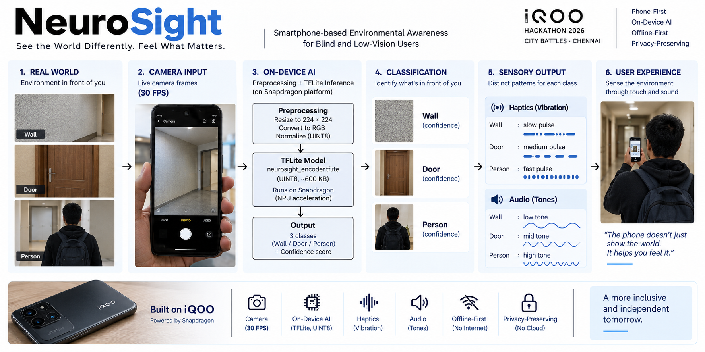
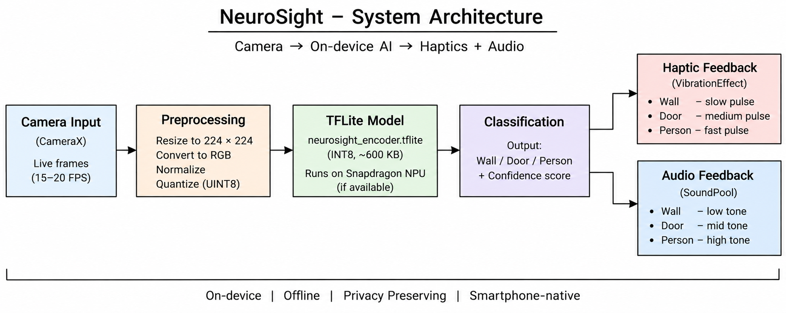
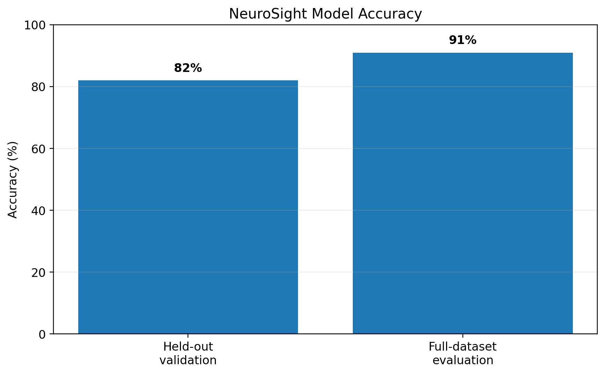
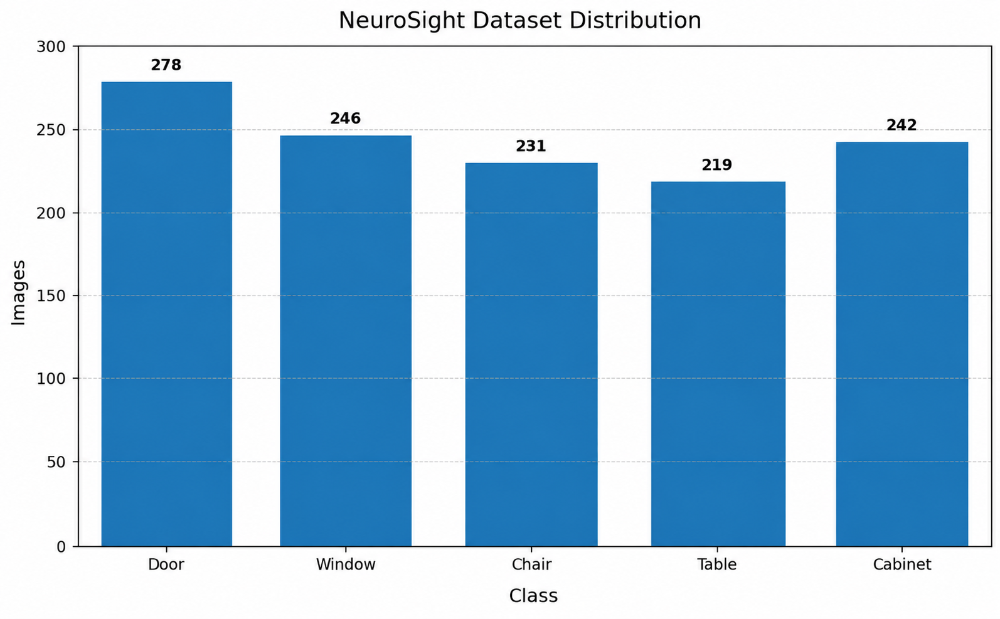

<div align="center">

# 🧠 NeuroSight

### See the World Differently. Feel What Matters.

**A phone-first assistive vision system that converts visual surroundings into haptic and audio feedback using on-device AI.**

**iQOO Hackathon 2026 · City Battles · Chennai**

`Phone-First` · `On-Device AI` · `Edge AI` · `Accessibility`

<br>

**📱 Phone-First** &nbsp; **🧠 On-Device** &nbsp; **⚡ Snapdragon / NPU Ready** &nbsp; **🔒 Offline-First**

</div>

---

## 🚀 What is NeuroSight?

**NeuroSight** is an Android prototype that uses the smartphone camera to recognize basic surroundings and communicate the result through **distinct vibration and audio patterns**.

Instead of sending camera data to a cloud service or relying only on a visual screen, NeuroSight explores a simple sensory-substitution pipeline:

> **Camera → On-Device AI → Haptics + Audio**

The current prototype recognizes:

- 🧱 **Wall**
- 🚪 **Door**
- 👤 **Person**

The smartphone acts as the sensing, computing, and feedback device.

<div align="center">

</div>

---

## 🎯 The Problem

For blind and low-vision users, understanding nearby surroundings can be difficult, especially in unfamiliar indoor environments.

Many assistive approaches can involve continuous voice descriptions, internet connectivity, cloud processing, or additional hardware.

### NeuroSight asks:

> **Can the smartphone already in a user's hand become a real-time sensory bridge to the surrounding environment?**

The prototype focuses on three building blocks:

**Visual input → Local intelligence → Non-visual feedback**

---

## 💡 The Core Idea

```text
                    REAL WORLD
                         │
                         ▼
                    📷 CAMERA
                         │
                         ▼
                IMAGE PROCESSING
                         │
                         ▼
                 🧠 ON-DEVICE AI
                         │
              ┌──────────┼──────────┐
              ▼          ▼          ▼
            WALL       DOOR      PERSON
              └──────────┼──────────┘
                         │
                  ┌──────┴──────┐
                  ▼             ▼
              📳 HAPTICS     🔊 AUDIO
                  │             │
                  └──────┬──────┘
                         ▼
                       USER
```

---

# 📱 Phone-First Architecture

NeuroSight is designed around the **smartphone as the primary product**.

| Phone Capability | Role in NeuroSight |
|---|---|
| 📷 Camera | Captures the surrounding scene |
| 🧠 Mobile Compute | Runs image processing and inference |
| ⚡ Snapdragon / NPU | Target for efficient mobile AI acceleration where supported |
| 📳 Vibration Motor | Communicates class-specific patterns |
| 🔊 Speaker | Provides audio feedback |
| 📱 Android | Integrates the complete experience |

The core workflow is designed to run locally rather than requiring a separate computer-vision device.

---

# 🧠 On-Device AI

The classification pipeline uses **TensorFlow Lite** and is designed for local smartphone inference.

### Key points

- **On-device inference**
- **TensorFlow Lite deployment**
- **UINT8 quantized model**
- **224 × 224 × 3 RGB input**
- **~600 KB model**
- **3-class classification**
- **Snapdragon / Hexagon NPU acceleration where supported by the device and runtime**
- **No mandatory cloud inference**

### Inference Pipeline

```text
Camera Frame
     ↓
Image Processing
     ↓
224 × 224 RGB
     ↓
TensorFlow Lite
     ↓
Wall / Door / Person
     ↓
Haptics + Audio
```

---

# ⚡ Why Edge / NPU?

The model is intentionally lightweight and quantized for mobile deployment.

The architecture is suitable for **edge AI execution** and is designed to take advantage of **Snapdragon / Hexagon NPU acceleration where supported by the device and runtime**.

This keeps the intelligence close to the sensor:

**Camera → Mobile AI → Feedback**

rather than:

**Camera → Cloud → Server → Phone**

### Benefits

- ⚡ Efficient mobile inference
- 🔒 Local camera processing
- 📡 Reduced dependence on connectivity
- 📱 No separate AI computer required for the core prototype

---

# 🔒 Offline-First

The core classification pipeline is designed to work locally on the smartphone.

```text
📷 Camera
   ↓
Local Image Processing
   ↓
On-Device TFLite Model
   ↓
Prediction
   ↓
📳 Haptics + 🔊 Audio
```

### Core pipeline does not require

- ❌ Cloud inference
- ❌ Camera-image upload
- ❌ Backend server
- ❌ Mandatory internet connection

### Why this matters

**Privacy** — camera data can remain on the device.

**Availability** — the core inference path does not depend on network access.

**Portability** — the complete prototype is centered around one smartphone.

---

# 🏗️ Technical Architecture

<div align="center">

</div>

### Processing flow

1. **CameraX** captures camera frames.
2. The frame is prepared for inference.
3. The image is resized to **224 × 224 RGB**.
4. TensorFlow Lite performs local classification.
5. The predicted class is passed to the feedback layer.
6. **HapticEngine** generates the corresponding vibration pattern.
7. **AudioEngine** provides the corresponding audio feedback.

---

# 🤖 AI Model

The trained model is bundled directly with the Android application:

```text
app/src/main/assets/neurosight_encoder.tflite
```

| Property | Value |
|---|---|
| Framework | TensorFlow Lite |
| Input | `224 × 224 × 3` |
| Input Type | `UINT8` |
| Output | `1 × 3` |
| Output Type | `UINT8` |
| Classes | Wall / Door / Person |
| Model Size | ~600 KB |

The lightweight model keeps the deployed AI footprint small and suitable for smartphone experimentation.

---

# 📊 Development Results

The current model was developed and evaluated as a **hackathon prototype** on a relatively small dataset.

<div align="center">

</div>

| Evaluation | Result |
|---|---:|
| Held-out validation | **~82%** |
| Full collected dataset evaluation | **~91%** |

These are development results, not production-level performance claims. Real-world performance can vary with lighting, camera angle, distance, environment, and unseen scenes.

---

# 📚 Dataset

The current development dataset contains approximately **65 images** across the three supported classes.

<div align="center">

</div>

| Class | Images |
|---|---:|
| 🧱 Wall | 19 |
| 🚪 Door | 23 |
| 👤 Person | 23 |
| **Total** | **65** |

The current dataset demonstrates the feasibility of the prototype. A production system would require a much larger and more diverse real-world dataset.

---

# 📳 Haptic + 🔊 Audio Feedback

NeuroSight maps each prediction to a distinguishable sensory pattern.

| Detection | Haptic Feedback | Audio Feedback |
|---|---|---|
| 🧱 Wall | Steady / slower pattern | Lower-frequency tone |
| 🚪 Door | Medium pulse pattern | Mid-frequency tone |
| 👤 Person | Faster pulse pattern | Higher-frequency tone |

### Implementation

```text
app/src/main/java/com/neurosight/app/haptics/HapticEngine.kt
app/src/main/java/com/neurosight/app/audio/AudioEngine.kt
```

The purpose is to create a simple **sensory vocabulary** that can be learned through repeated interaction.

---

# 🧩 Sensory Substitution

Traditional computer-vision applications often follow:

```text
Camera → AI → Screen
```

NeuroSight explores:

```text
Camera → AI → Haptics + Audio
```

The current prototype provides three basic associations:

```text
Pattern A → Wall
Pattern B → Door
Pattern C → Person
```

The same interaction model can later be extended to more environmental classes.

---

# 🖥️ Office Kit

The **phone remains the primary product**.

The Office Kit provides a laptop-side environment for development, debugging, monitoring, screen mirroring, and demonstration.

```text
                 OFFICE KIT
                     │
                     ▼
              ┌──────────────┐
              │    LAPTOP    │
              │              │
              │ Development  │
              │ Debugging    │
              │ Monitoring   │
              │ Mirroring    │
              └──────┬───────┘
                     │
                     ▼
              ┌──────────────┐
              │  iQOO PHONE  │
              │              │
              │ Camera       │
              │ On-device AI │
              │ Haptics      │
              │ Audio        │
              └──────────────┘
```

### Phone

- Camera capture
- Image processing
- AI inference
- Classification
- Haptic feedback
- Audio feedback

### Office Kit

- Development
- Debugging
- Device monitoring
- Screen mirroring
- Demonstration

---

# 🛠️ Technology Stack

| Area | Technologies |
|---|---|
| Android | Kotlin, Jetpack Compose |
| Camera | CameraX |
| AI | TensorFlow Lite |
| Model | Lightweight CNN, UINT8 quantization |
| Feedback | Android Vibration + Audio APIs |
| Concurrency | Kotlin Coroutines |
| Hardware | iQOO smartphone, Snapdragon platform |

---

# 📂 Project Structure

```text
NeuroSight/
│
├── app/
│   └── src/main/
│       ├── assets/
│       │   └── neurosight_encoder.tflite
│       │
│       ├── java/com/neurosight/app/
│       │   ├── MainActivity.kt
│       │   ├── audio/
│       │   │   └── AudioEngine.kt
│       │   ├── camera/
│       │   │   └── CameraController.kt
│       │   ├── haptics/
│       │   │   └── HapticEngine.kt
│       │   ├── ml/
│       │   │   └── NeuroSightClassifier.kt
│       │   ├── ui/
│       │   │   └── MainScreen.kt
│       │   └── util/
│       │       └── ImageUtils.kt
│       │
│       └── AndroidManifest.xml
│
├── assets/
│   ├── neurosight-system-overview.png
│   ├── neurosight-architecture.png
│   ├── neurosight-accuracy.png
│   └── neurosight-dataset-distribution.png
│
├── docs/
│   └── MODEL_TRAINING.md
│
├── training/
│   └── train_neurosight.py
│
├── .github/
│   └── workflows/
│       └── build-apk.yml
│
├── build.gradle.kts
├── settings.gradle.kts
├── gradle.properties
├── gradlew
└── gradlew.bat
```

---

# 🚀 Build & Run

### Requirements

- Android Studio
- Compatible JDK
- Android device for physical testing
- USB debugging enabled

### Clone

```bash
git clone https://github.com/harshtakalkar037-boop/NeuroSight.git
cd NeuroSight
```

### Build

```bash
./gradlew assembleDebug
```

### Run

1. Connect the Android device.
2. Enable Developer Options and USB Debugging.
3. Open the project in Android Studio.
4. Select the connected device.
5. Build and run the application.
6. Grant camera permission.
7. Start the NeuroSight experience.

---

# 🧪 Training

Training code and documentation are included in the repository.

```text
training/train_neurosight.py
docs/MODEL_TRAINING.md
```

The development pipeline includes:

- Dataset preparation
- Image augmentation
- Mixup
- Label smoothing
- Lightweight CNN training
- UINT8 TensorFlow Lite deployment

---

# 🌍 Potential Impact

NeuroSight explores how a **device already carried by the user** can become an assistive interface.

### Potential applications

- ♿ Accessibility
- 🏠 Indoor awareness
- 🚪 Environmental awareness
- 🧠 Sensory substitution
- 📱 Accessible mobile computing
- 🔬 Assistive technology research

The long-term direction is to expand from a three-class prototype into a richer environmental-awareness system.

---

# 🛣️ Roadmap

### 01 · Better Data

Larger datasets, more environments, different lighting conditions, distances, camera angles, and real-world smartphone images.

### 02 · More Classes

Stairs, obstacles, vehicles, furniture, crossings, entrances, and indoor landmarks.

### 03 · Personalization

Custom haptic patterns, custom audio patterns, adaptive feedback, and user training.

### 04 · Wearables

Explore haptic wristbands, multi-point vibration, and wireless audio integration.

### 05 · Real-World Evaluation

Larger-scale testing, accessibility collaboration, usability studies, and safety evaluation.

---

# ⚠️ Limitations & Safety

NeuroSight is currently a **hackathon prototype**.

- Only three classes are supported.
- The training dataset is relatively small.
- Performance can vary in unseen environments.
- Lighting, distance, and camera angle can affect predictions.
- Similar-looking objects may be misclassified.
- Extensive real-world accessibility testing has not yet been completed.

> **NeuroSight should not currently replace white canes, guide dogs, human assistance, established mobility aids, or professional accessibility systems.**

---

# 🏆 Why NeuroSight?

| Hackathon Focus | NeuroSight |
|---|---|
| 📱 Phone-First | Camera, compute, haptics, and audio are integrated into the phone |
| 🧠 On-Device AI | TensorFlow Lite inference runs locally |
| ⚡ NPU / Edge AI | Designed for Snapdragon / Hexagon NPU acceleration where supported |
| 🔒 Offline | Core classification does not require cloud inference |
| 📳 Creative Hardware Use | AI predictions become vibration and audio patterns |
| 🛠️ Technical Depth | Computer vision + ML + Android + edge deployment |
| 🖥️ Office Kit | Laptop supports development, monitoring, mirroring, and demonstration |
| ♿ Impact | Explores accessible environmental awareness |

---

# 📌 Current Prototype

**Classes:** Wall · Door · Person  
**Model:** TensorFlow Lite  
**Input:** 224 × 224 RGB  
**Model size:** ~600 KB  
**Inference:** On-device  
**Feedback:** Haptics + Audio  
**Connectivity:** Core pipeline designed for offline operation  
**Platform:** Android / iQOO smartphone  
**AI acceleration:** Snapdragon / Hexagon NPU where supported by device and runtime

---

# 💭 Vision

NeuroSight is built around one question:

> **What if a smartphone could communicate the world without relying only on a screen?**

Today:

```text
Camera
  ↓
On-Device AI
  ↓
Wall / Door / Person
  ↓
Haptics + Audio
```

Tomorrow:

```text
Smartphone
    ↓
Environmental Understanding
    ↓
Personalized Sensory Feedback
    ↓
Greater Independence
```

The current prototype is small. **The vision is to turn the smartphone into a sensory bridge between people and the world around them.**

---

<div align="center">

## 🧠 NeuroSight

### See the World Differently. Feel What Matters.

**Built for iQOO Hackathon 2026**

`Phone-First` · `On-Device AI` · `Offline-First` · `Accessibility`

</div>
